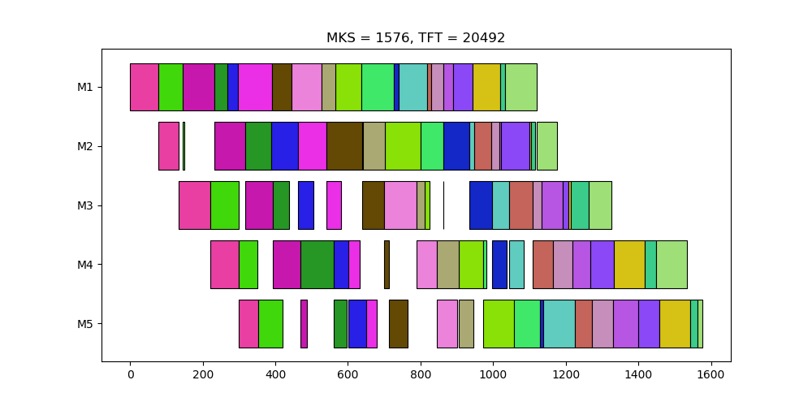

# Gantt Charts Viewer for PFSP
A tool for visualize the gantt charts of permutation flow shop scheduling <p>


# Requirements
- Python 3.6
- Matplotlib
- Pandas

# Usage
- Show gantt chart from a random permutation
```sh
GanttChartsViewer.py -i <instance file>
```
- Show gantt charts from multiple permutations
```sh
GanttChartsViewer.py -i <instance file> -p <permutations file>
```
- Save gantt charts in PNG format
```sh
GanttChartsViewer.py -i <instance file> -s
GanttChartsViewer.py -i <instance file> -p <permutations file> -s
```
